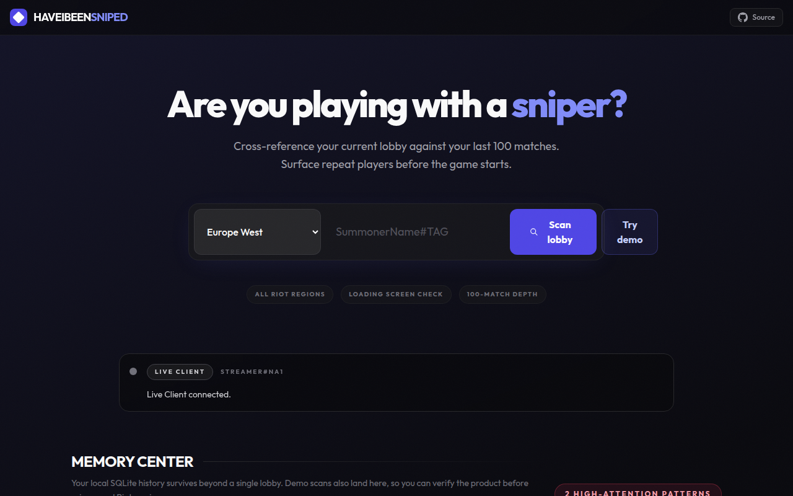
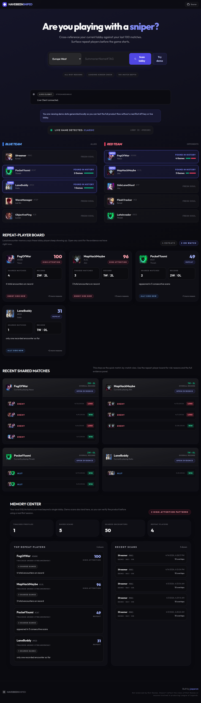
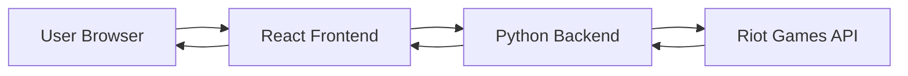

# Have I Been Sniped?





Check if you're playing with stream snipers! This tool analyzes your current League of Legends lobby and checks if any players have appeared in your last 100 matches.

## Features

- **Real-time Lobby Detection**: Instantly checks if you're in a live game
- **100 Match Deep Scan**: Analyzes your last 100 matches to find overlaps
- **Win/Loss Tracking**: See your history with each player
- **All Regions Supported**: Works with all Riot Games regions

## Prerequisites

- **Node.js** (v16 or higher)
- **Python 3.8+**
- **Riot Games API Key** - Get yours at [Riot Developer Portal](https://developer.riotgames.com/)

## Quick Start

### 1. Backend Setup

```bash
cd backend
pip install -r requirements.txt
cp config.yaml.example config.yaml
# Edit config.yaml and add your Riot API key
python main.py
```

The backend will start on `http://localhost:5000`

### 2. Frontend Setup

```bash
npm install
cp .env.local.example .env.local
npm run dev
```

The frontend will start on `http://localhost:4000`

### 3. Get a Riot API Key

1. Go to [Riot Developer Portal](https://developer.riotgames.com/)
2. Sign in with your Riot account
3. Register a new application or use your personal API key
4. Copy the API key to `backend/config.yaml`

**Note**: Development API keys expire after 24 hours. For production, apply for a production key.

## How It Works



1. User enters their Riot ID (Name#TAG) and region
2. Frontend sends request to backend
3. Backend checks if player is in a live game via Riot Spectator API
4. Backend fetches last 100 matches and cross-references lobby participants
5. Results show which players you've played with/against before

## Project Structure

```
haveibeensniped/
├── backend/              # Python Flask backend
│   ├── main.py          # API server
│   ├── riot_client.py   # Riot API wrapper
│   ├── config.yaml      # Configuration (create from .example)
│   └── requirements.txt # Python dependencies
├── components/          # React components
├── services/           # Frontend services
└── types.ts           # TypeScript types
```

## Troubleshooting

### Common Issues

**"Invalid API Key"**
- Make sure you copied your Riot API key correctly to `backend/config.yaml`
- Development keys expire after 24 hours - generate a new one

**"Player not in live game"**
- You must be in champion select or loading screen
- Streamer mode must be **disabled** for the person you're searching, otherwise hey won't show up.
- The check won't work in practice tool or custom games with bots

**CORS Errors**
- Ensure backend is running on port 5000
- Check that `cors_origins` in config.yaml includes your frontend URL

**Rate Limit Errors**
- Development keys: 20 requests/sec, 100 requests/2 min
- Wait a moment and try again
- Consider applying for a production key

## Development


## Interactive CLI

The project now includes an interactive CLI for managing configuration and running checks without starting the server.

```bash
python backend/cli.py
```

**Interactive Experience:**
```text
╭──────────────────────────────────╮
│ HAVE I BEEN SNIPED?              │
│ League of Legends Match Analyzer │
╰──────────────────────────────────╯

? Select a Task:
  Query User (Active Game & Snipes)
  Manage Configuration (API Key)
  Check Integrity (Validate connection)
  Exit
```

**Features:**
- **Query User:** Check if a player is in an active game and scan for snipers.
- **Manage Configuration:** Update your Riot API Key securely.
- **Check Integrity:** Validate your API Key against the Riot API.
- **Memory:** Remembers your last queried player for quick access.

### API Endpoints

- `POST /api/check-game` - Check if player is in a live game
- `POST /api/analyze-snipes` - Analyze match history for overlaps

### Regional Routing

The backend handles two types of Riot API routing:
- **Regional**: americas, europe, asia, sea (for Account API)
- **Platform**: na1, euw1, kr, etc. (for game-specific APIs)

## Credits

Created by [jasperan](https://github.com/jasperan)
