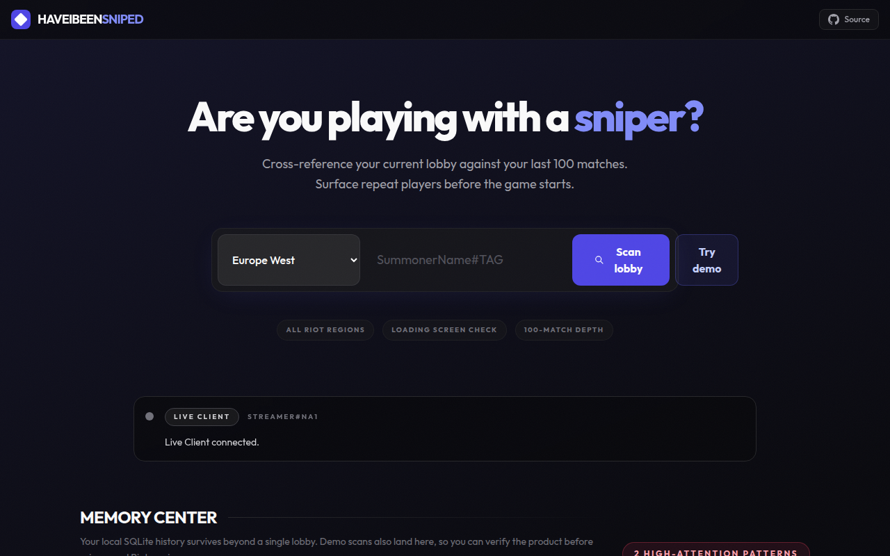
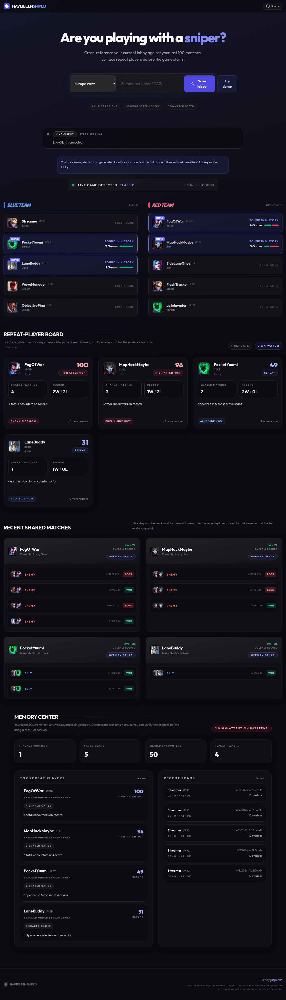
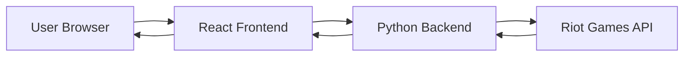

# Have I Been Sniped?





Check if you're playing with stream snipers! This tool analyzes your current League of Legends lobby and checks if any players have appeared in your last 100 matches.

## Features

- **Loading Screen Check**: Scan your lobby while the game loads, no waiting for post-game stats
- **100-Match Deep Scan**: Cross-references every lobby participant against your last 100 games
- **Risk Scoring**: Tracks win/loss records, repeat frequency, and flags suspicious patterns
- **All Regions Supported**: Works with all Riot Games regions

## Local Encounter Memory

Successful manual scans now leave a local paper trail. Each successful scan stores:

- the tracked Riot ID you searched
- the current lobby snapshot for that scan
- shared matches pulled from the last 100 games
- local repeat-player risk scoring for anyone who keeps showing up

By default, that data lives in `backend/data/haveibeensniped.db`. Fresh installs start blank. Delete that file if you want a hard reset.

**Repeat-player tiers**
- **background**: some history exists, but the pattern is still light
- **repeat**: this player has shown up more than once
- **watch**: the repeat pattern is getting harder to ignore
- **high-attention**: this player keeps surfacing across saved scans

These labels describe encounter recurrence, not intent. They tell you who keeps reappearing in local memory, not why.

## Live Client Auto-Detect

Phase 2 adds local active-game detection through Riot's Live Client Data API at `https://127.0.0.1:2999/liveclientdata/allgamedata`.

What it does now:
- polls the local game client every 5 seconds while the app page is open
- matches the local Riot ID against your saved tracked profile
- auto-runs one scan per live-session fingerprint instead of hammering `/api/scan`

What it does not do yet:
- it does not keep running if the page is closed
- it does not guess a region from thin air, it needs a saved tracked profile match first

## Prerequisites

- **Node.js** (v16 or higher)
- **Python 3.8+**
- **Riot Games API Key** *(optional for demo mode; required for live Riot scans)* - Get yours at [Riot Developer Portal](https://developer.riotgames.com/)

## Quick Start

<!-- one-command-install -->
> **One-command install** — clone, configure, and run in a single step:
>
> ```bash
> curl -fsSL https://raw.githubusercontent.com/jasperan/haveibeensniped/main/install.sh | bash
> ```
>
> <details><summary>Advanced options</summary>
>
> Override install location:
> ```bash
> PROJECT_DIR=/opt/myapp curl -fsSL https://raw.githubusercontent.com/jasperan/haveibeensniped/main/install.sh | bash
> ```
>
> Or install manually:
> ```bash
> git clone https://github.com/jasperan/haveibeensniped.git
> cd haveibeensniped
> # See below for setup instructions
> ```
> </details>


### 1. Backend Setup

```bash
cd backend
python3 -m venv .venv
source .venv/bin/activate
pip install -r requirements.txt
cp config.yaml.example config.yaml
python main.py
```

The backend will start on `http://localhost:5000`

**Demo-first note:** the backend can now run in demo mode with the example config, even before you add a real Riot API key. That lets you try the full UI flow immediately.

### 2. Frontend Setup

```bash
npm install
cp .env.local.example .env.local
npm run dev
```

The frontend will start on `http://localhost:4000`

### 3. Try the App Immediately in Demo Mode

1. Leave `backend/config.yaml.example` as-is, or set `HIBS_DEMO_MODE=1`
2. Start the backend with `npm run demo:backend` or `cd backend && source .venv/bin/activate && HIBS_DEMO_MODE=1 python main.py`
3. Start the frontend with `npm run dev`
4. Open `http://localhost:4000`
5. Click **Try demo**
6. Open a repeat-player card and save a watch note

This path works without a live League client and without a real Riot API key. For one-command local demo startup, use `npm run demo`.

### 4. Get a Riot API Key

1. Go to [Riot Developer Portal](https://developer.riotgames.com/)
2. Sign in with your Riot account
3. Register a new application or use your personal API key
4. Copy the API key to `backend/config.yaml`

**Note**: Development API keys expire after 24 hours. For production, apply for a production key.

## How It Works


```mermaid
graph LR
    User[User Browser] --> Frontend[React Frontend]
    Frontend --> Backend[Python Backend]
    Backend --> RiotAPI[Riot Games API]
    RiotAPI --> Backend
    Backend --> Frontend
    Frontend --> User
```

1. User enters their Riot ID (Name#TAG) and region
2. Frontend sends request to backend
3. Backend checks if player is in a live game via Riot Spectator API
4. Backend fetches last 100 matches and cross-references lobby participants
5. Results show which players you've played with/against before

## Project Structure

```
haveibeensniped/
├── backend/              # Python Flask backend
│   ├── main.py          # API server
│   ├── riot_client.py   # Riot API wrapper
│   ├── config.yaml      # Configuration (create from .example)
│   └── requirements.txt # Python dependencies
├── components/          # React components
├── services/           # Frontend services
└── types.ts           # TypeScript types
```

## Troubleshooting

### Common Issues

**"Invalid API Key"**
- Make sure you copied your Riot API key correctly to `backend/config.yaml`
- Development keys expire after 24 hours - generate a new one

**"Player not in live game"**
- You must be in champion select or loading screen
- Streamer mode must be **disabled** for the person you're searching, otherwise hey won't show up.
- The check won't work in practice tool or custom games with bots

**CORS Errors**
- Ensure backend is running on port 5000
- Check that `cors_origins` in config.yaml includes your frontend URL

**Rate Limit Errors**
- Development keys: 20 requests/sec, 100 requests/2 min
- Wait a moment and try again
- Consider applying for a production key

## Development


## Interactive CLI

The project now includes an interactive CLI for managing configuration and running checks without starting the server.

```bash
python backend/cli.py
```

**Interactive Experience:**
```text
╭──────────────────────────────────╮
│ HAVE I BEEN SNIPED?              │
│ League of Legends Match Analyzer │
╰──────────────────────────────────╯

? Select a Task:
  Query User (Active Game & Snipes)
  Manage Configuration (API Key)
  Check Integrity (Validate connection)
  Exit
```

**Features:**
- **Query User:** Check if a player is in an active game and scan for snipers.
- **Manage Configuration:** Update your Riot API Key securely.
- **Check Integrity:** Validate your API Key against the Riot API.
- **Memory:** Remembers your last queried player for quick access.

### API Endpoints

- `POST /api/scan` - Run a manual scan, persist the local lobby snapshot and shared matches, then return repeat-player scoring
- `GET /api/live-client/status` - Report local Live Client connection state, active Riot ID, saved tracked profile match, and whether auto-scan can fire

### Regional Routing

The backend handles two types of Riot API routing:
- **Regional**: americas, europe, asia, sea (for Account API)
- **Platform**: na1, euw1, kr, etc. (for game-specific APIs)

## Verification

```bash
cd backend && python -m pytest -q
npm run verify
```

## Credits

Created by [jasperan](https://github.com/jasperan)
